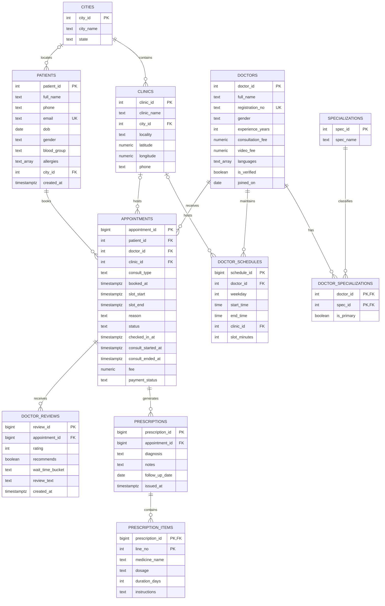

# Practo Doctor Appointments – ER Diagram

```mermaid
erDiagram

    CITIES {
        int city_id PK
        text city_name
        text state
    }

    CLINICS {
        int clinic_id PK
        text clinic_name
        int city_id FK
        text locality
        numeric latitude
        numeric longitude
        text phone
    }

    PATIENTS {
        int patient_id PK
        text full_name
        text phone
        text email UK
        date dob
        text gender
        text blood_group
        text_array allergies
        int city_id FK
        timestamptz created_at
    }

    DOCTORS {
        int doctor_id PK
        text full_name
        text registration_no UK
        text gender
        int experience_years
        numeric consultation_fee
        numeric video_fee
        text_array languages
        boolean is_verified
        date joined_on
    }

    SPECIALIZATIONS {
        int spec_id PK
        text spec_name
    }

    DOCTOR_SPECIALIZATIONS {
        int doctor_id PK, FK
        int spec_id PK, FK
        boolean is_primary
    }

    DOCTOR_SCHEDULES {
        bigint schedule_id PK
        int doctor_id FK
        int weekday
        time start_time
        time end_time
        int clinic_id FK
        int slot_minutes
    }

    APPOINTMENTS {
        bigint appointment_id PK
        int patient_id FK
        int doctor_id FK
        int clinic_id FK
        text consult_type
        timestamptz booked_at
        timestamptz slot_start
        timestamptz slot_end
        text reason
        text status
        timestamptz checked_in_at
        timestamptz consult_started_at
        timestamptz consult_ended_at
        numeric fee
        text payment_status
    }

    PRESCRIPTIONS {
        bigint prescription_id PK
        bigint appointment_id FK
        text diagnosis
        text notes
        date follow_up_date
        timestamptz issued_at
    }

    PRESCRIPTION_ITEMS {
        bigint prescription_id PK, FK
        int line_no PK
        text medicine_name
        text dosage
        int duration_days
        text instructions
    }

    DOCTOR_REVIEWS {
        bigint review_id PK
        bigint appointment_id FK
        int rating
        boolean recommends
        text wait_time_bucket
        text review_text
        timestamptz created_at
    }

    CITIES ||--o{ CLINICS : contains
    CITIES o|--o{ PATIENTS : locates

    DOCTORS ||--o{ DOCTOR_SPECIALIZATIONS : has
    SPECIALIZATIONS ||--o{ DOCTOR_SPECIALIZATIONS : classifies

    DOCTORS ||--o{ DOCTOR_SCHEDULES : maintains
    CLINICS o|--o{ DOCTOR_SCHEDULES : hosts

    PATIENTS ||--o{ APPOINTMENTS : books
    DOCTORS ||--o{ APPOINTMENTS : receives
    CLINICS o|--o{ APPOINTMENTS : hosts

    APPOINTMENTS ||--o{ PRESCRIPTIONS : generates
    PRESCRIPTIONS ||--o{ PRESCRIPTION_ITEMS : contains
    APPOINTMENTS ||--o{ DOCTOR_REVIEWS : receives
```
